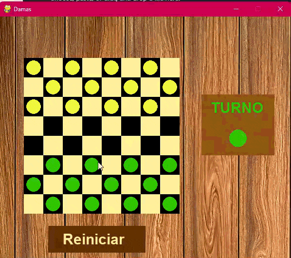

# ♟️ Juego de damas contra IA


Juego de damas desarrollado en Python con Pygame. Permite jugar una partida contra una inteligencia artificial desde una interfaz gráfica.

![Captura del juego]

## ¿Qué hace el proyecto?

El jugador controla las fichas verdes y se enfrenta a las fichas amarillas, controladas por la computadora. El juego muestra los movimientos disponibles al seleccionar una ficha, gestiona los turnos y permite reiniciar la partida.

Para elegir sus jugadas, la IA analiza posibles movimientos mediante el algoritmo **minimax con poda alfa-beta**. Este proyecto nos permitió aplicar lógica de programación, manejo de eventos, representación de un tablero y búsqueda de decisiones en un juego.

## Demostración



## Funcionalidades

- Partida de damas entre un jugador y la computadora.
- Selección de fichas y visualización de movimientos posibles.
- Captura y coronación de fichas.
- Detección del ganador.
- Botón para reiniciar la partida.

## Tecnologías utilizadas

- Python
- Pygame

## Contenido del repositorio

- `ai_prueba/damas_ai.py`: versión del juego que incluye la IA.
- `ai_prueba/constantes.py`: valores utilizados para dibujar el tablero y las fichas.
- `ai_prueba/IMG/`: imágenes utilizadas en la interfaz.
- `ai/`: versión inicial del juego, sin IA (referencia del desarrollo).

## Cómo ejecutar el juego

1. Instala Python y Pygame:

```bash
   pip install pygame
```

2. Clona este repositorio:

```bash
   git clone https://github.com/ambararr/ai.git
```

   O descárgalo desde **Code → Download ZIP**.

3. Abre una terminal en la carpeta principal del repositorio y ejecuta:

```bash
   python ai_prueba/damas_ai.py
```

4. Haz clic en una ficha verde para ver sus movimientos y selecciona una casilla disponible para moverla. Usa el botón de reinicio para comenzar una nueva partida en cualquier momento.

> **Nota:** actualmente las rutas de las imágenes en el código usan separadores de Windows, por lo que la ejecución puede requerir ajustar esas rutas si utilizas macOS o Linux.

## Posibles mejoras

- Soporte multiplataforma para las rutas de imágenes.
- Modo de dos jugadores (sin IA).
- Ajuste de dificultad de la IA.

##  Proyecto académico de programación e inteligencia artificial.
